# 4D fMRI CrossFormer (4DfCF)

This repository contains the implementation of the 4D fMRI CrossFormer (4DfCF), a novel vision transformer architecture designed to process high-dimensional 4D fMRI data. The 4DfCF integrates temporal and spatial dimensions to effectively learn and predict cognitive and clinical outcomes.

## Overview

Investigating the spatiotemporal dynamics of the human brain is a complex challenge due to the intricate nature of brain networks and the limitations of current analytical methods. The 4D fMRI CrossFormer addresses these challenges with an innovative mechanism using cross-scale embeddings and hierarchical attention structures.

## Architecture

The overall architecture of the 4D fMRI CrossFormer is structured hierarchically into four stages, each consisting of a 4D Cross-Scale Embedding Layer (4D CEL) and several 4D CrossFormer Blocks. A specialized head is integrated for classification tasks.

### Model Structure
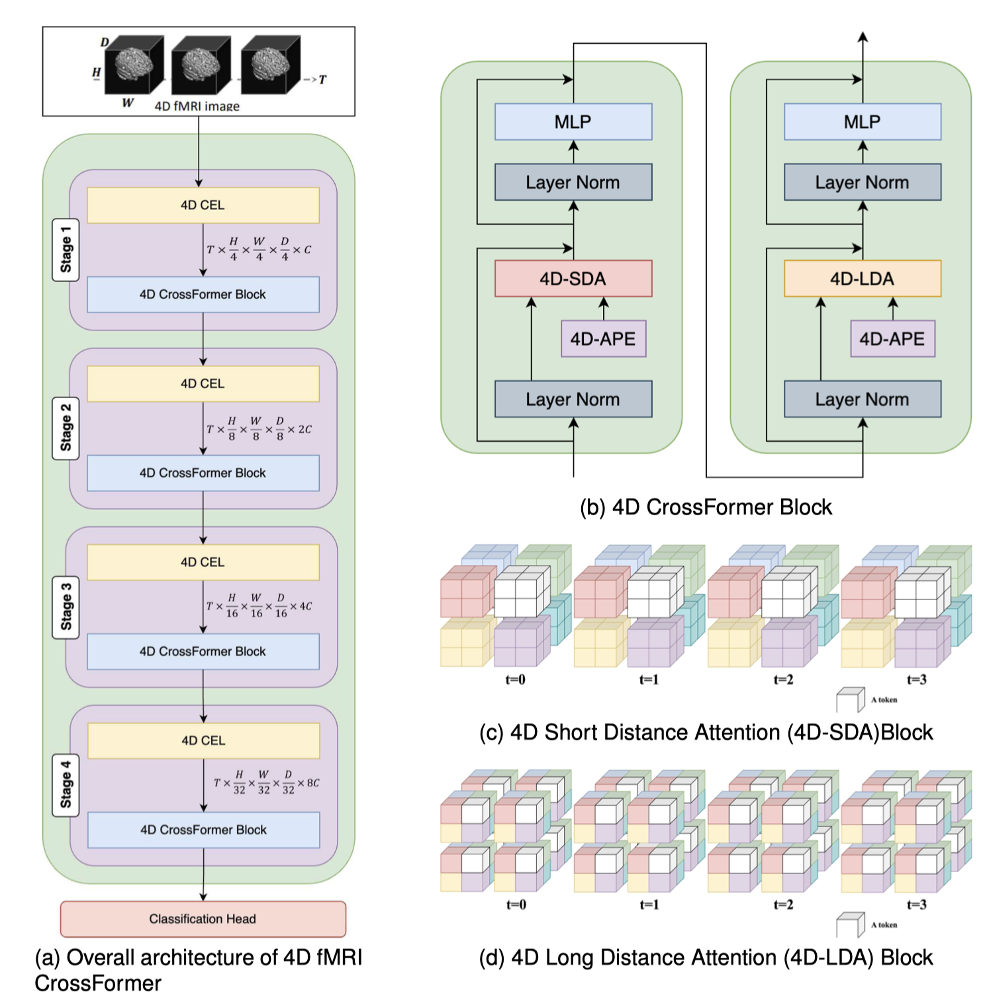

**Figure 1:** (a) Overall architecture of 4D fMRI CrossFormer. (b) Detailed structure of the 4D CrossFormer Block. (c) 4D Short Distance Attention (4D-SDA) Block. (d) 4D Long Distance Attention (4D-LDA) Block.

## Experimental Results

The performance of the 4D fMRI CrossFormer was evaluated on three benchmark datasets: ADHD-200, Alzheimer's Disease Neuroimaging Initiative (ADNI), and Autism Brain Imaging Data Exchange (ABIDE). The results show that the 4DfCF consistently outperforms state-of-the-art baseline models.

### Training Accuracy and Loss

The 4D fMRI CrossFormer demonstrated superior training accuracy and reduced loss across multiple sites (NYU, OHSU, Peking 2, NeuroIMAGE), consistently outperforming baseline models. The results show rapid convergence, emphasizing the model’s effectiveness in handling complex ADHD-200 data.

[//]: # (![Training Accuracy and Loss]&#40;readme_img/results1_fig1.png&#41;)
<p align="center">
  <figure style="display:inline-block; margin:10px;">
    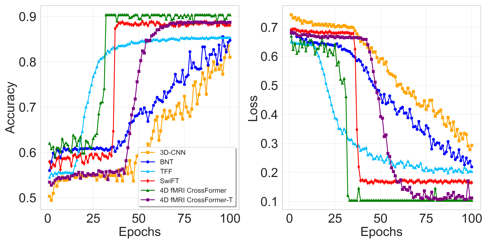
    <figcaption>(a) Training Accuracy and Loss in NYU</figcaption>
  </figure>
  <figure style="display:inline-block; margin:10px;">
    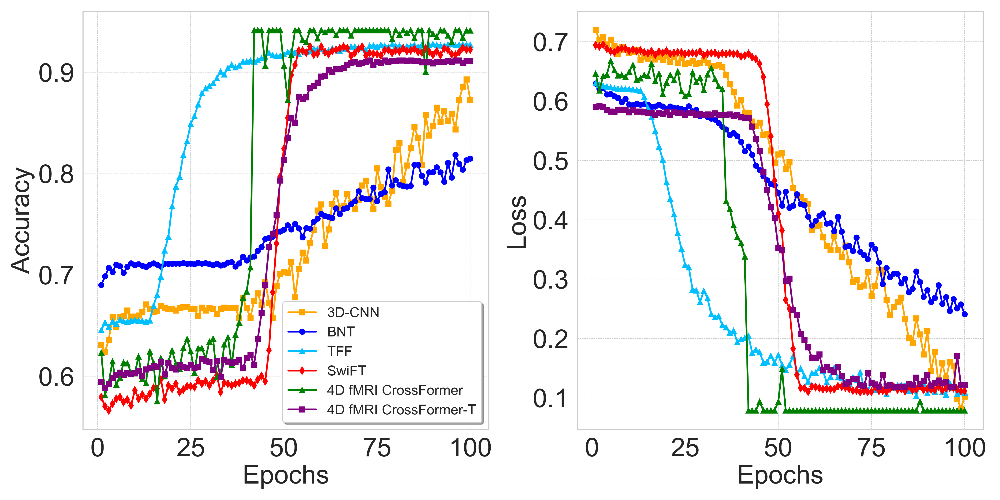
    <figcaption>(b) Training Accuracy and Loss in OHSU</figcaption>
  </figure>
  <br>
  <figure style="display:inline-block; margin:10px;">
    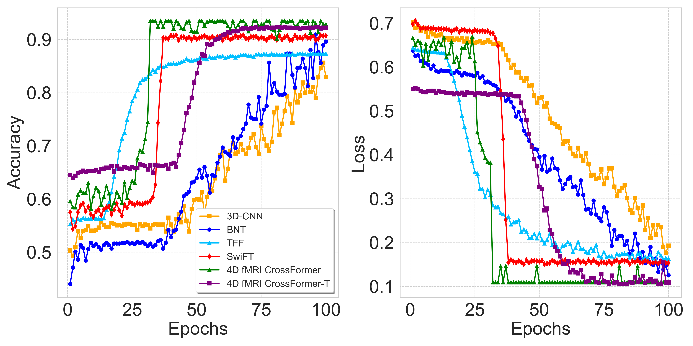
    <figcaption>(c) Training Accuracy and Loss in Peking 2</figcaption>
  </figure>
  <figure style="display:inline-block; margin:10px;">
    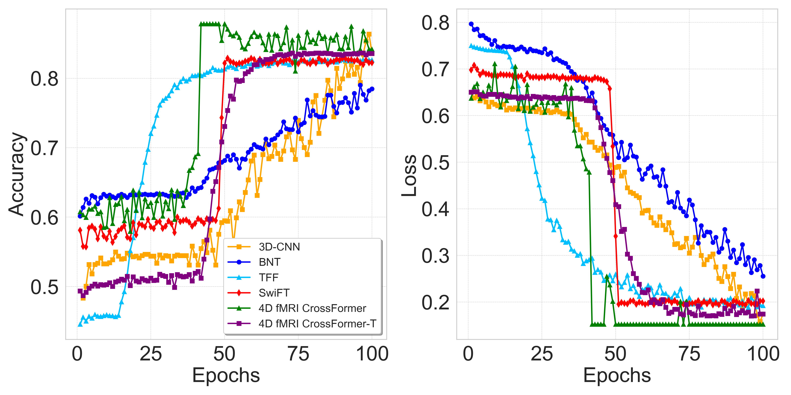
    <figcaption>(d) Training Accuracy and Loss in NeuroIMAGE</figcaption>
  </figure>
</p>


**Figure 2:** Comparison of Training Accuracy and Loss on ADHD-200 Datasets Across Multiple Sites (NYU, OHSU, Peking 2, NeuroIMAGE).

On the ADNI and ABIDE datasets, the 4D fMRI CrossFormer achieved higher training accuracy and lower losses compared to other models, showcasing fast convergence and robust performance. These results highlight the model’s capability in effectively analyzing complex patterns related to Alzheimer’s and Autism Spectrum Disorders.

[//]: # (![Training Accuracy and Loss]&#40;readme_img/results2_fig1.png&#41;)

<p align="center">
  <figure style="display:inline-block; margin:10px;">
    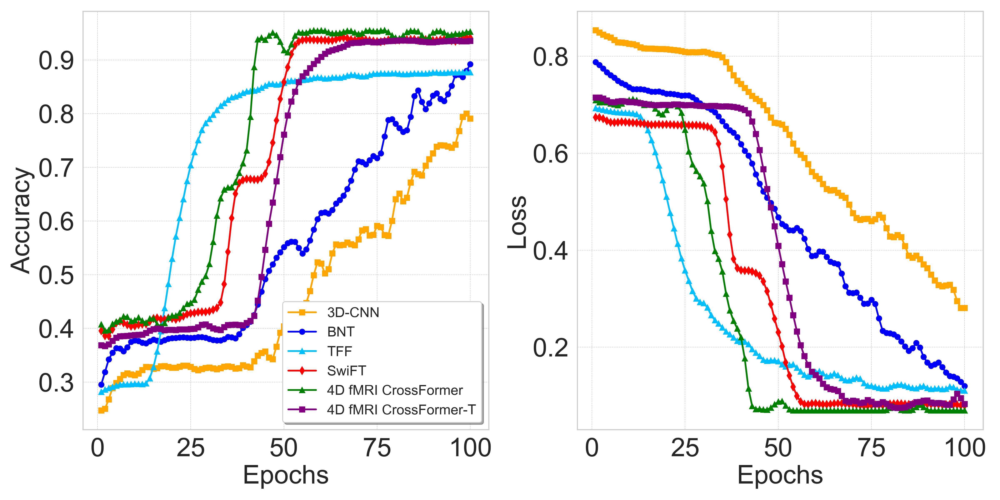
    <figcaption>(a) Training Accuracy and Loss in ADNI </figcaption>
  </figure>
  <figure style="display:inline-block; margin:10px;">
    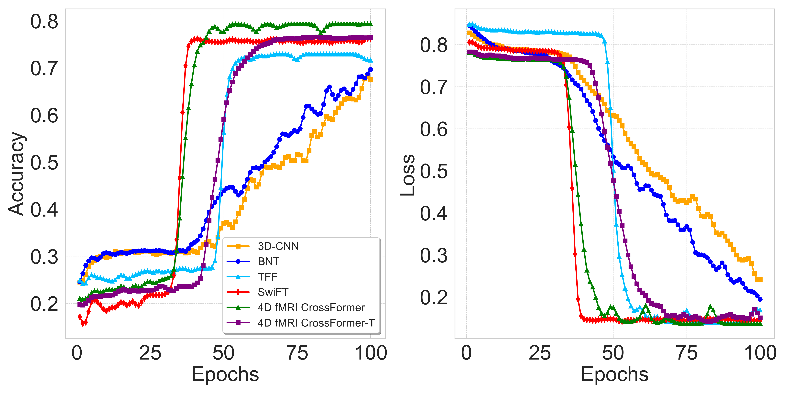
    <figcaption>(b) Training Accuracy and Loss in ABIDE </figcaption>
  </figure>

</p>

**Figure 3:** Comparison of Training Accuracy and Loss on ADNI and ABIDE Datasets.

### Effect of Pre-Training
The pre-training experiments reveal that models pre-trained on one dataset and fine-tuned on another achieve faster convergence and higher accuracy.

<p align="center">
  <figure style="display:inline-block; margin:10px;">
    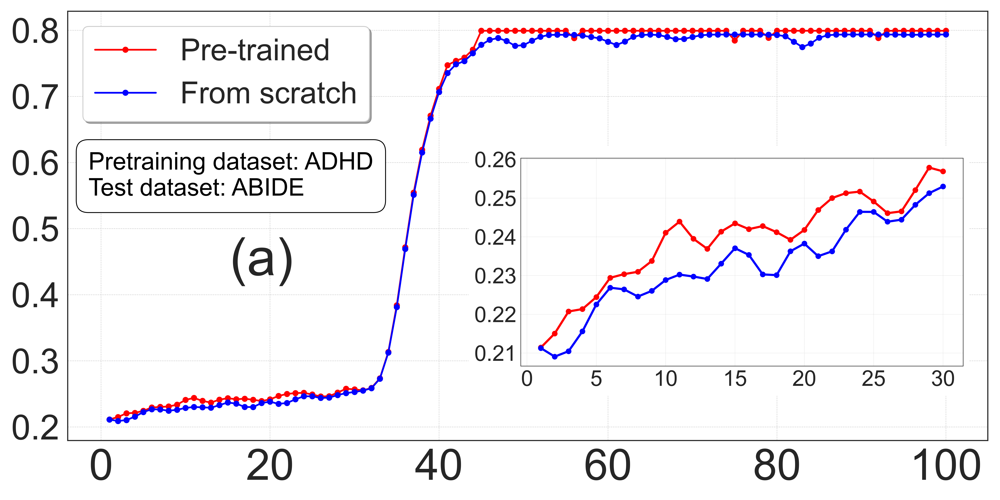
    <figcaption>(a) The effect of ADHD-200 pre-trained on the ABIDE classification tasks. </figcaption>
  </figure>
  <figure style="display:inline-block; margin:10px;">
    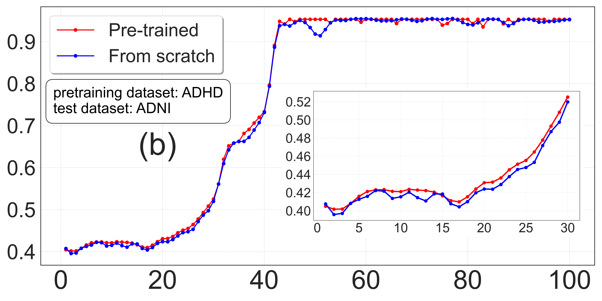
    <figcaption>(b) The effect of ADHD-200 pre-trained on the ADNI classification tasks.</figcaption>
  </figure>
  <br>
  <figure style="display:inline-block; margin:10px;">
    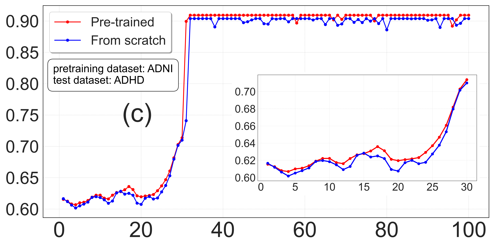
    <figcaption>(c) The effect of ADNI pre-trained on the ADHD-200 classification tasks.</figcaption>
  </figure>
  <figure style="display:inline-block; margin:10px;">
    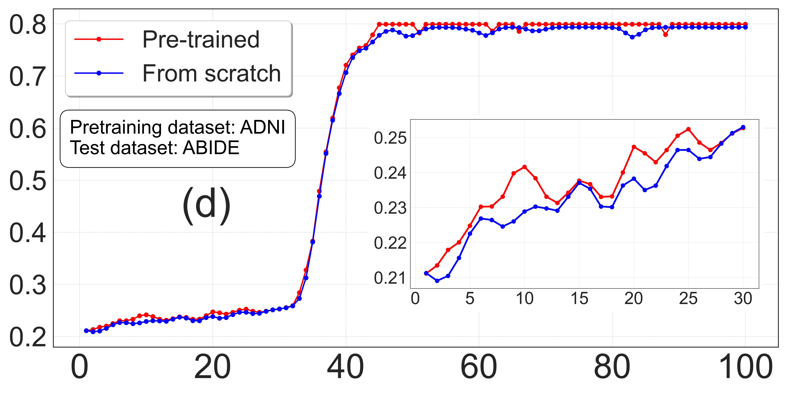
    <figcaption>(d) The effect of ADNI pre-trained on the ABIDE classification
tasks. </figcaption>
  </figure>
  <br>
  <figure style="display:inline-block; margin:10px;">
    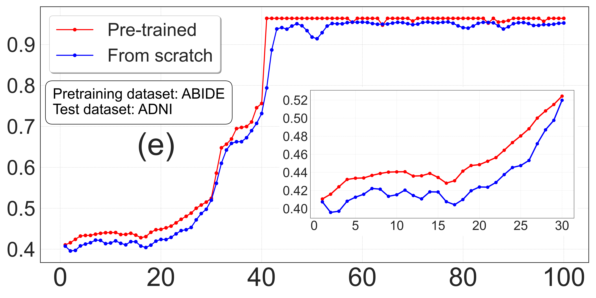
    <figcaption>(e) The effect of ABIDE pre-trained on the ADNI classification tasks. </figcaption>
  </figure>
  <figure style="display:inline-block; margin:10px;">
    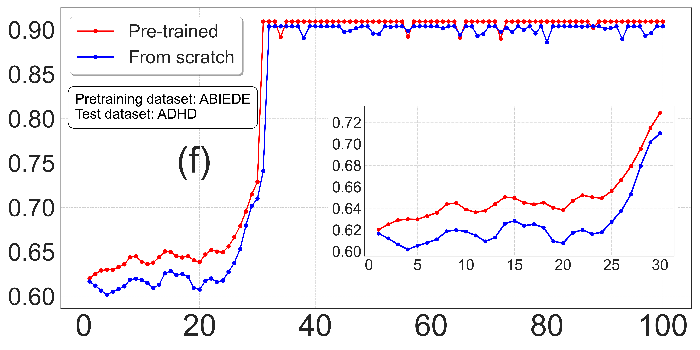
    <figcaption>(f) The effect of ABIDE pre-trained on the ADHD-200
classification tasks. </figcaption>
  </figure>
</p>

### Interpretation of the Results (XAI)


## Datasets

The datasets used in this study are:
1. **ADHD-200**: A multi-site collection aimed at understanding ADHD through brain imaging and related behavioral outcomes. <http://preprocessed-connectomes-project.org/adhd200/>
2. **ADNI**: A dataset aimed at understanding Alzheimer's Disease through brain imaging data. <https://ida.loni.usc.edu/login.jsp?project=ADNI>
3. **ABIDE**: Focuses on Autism Spectrum Disorder by aggregating brain imaging data from multiple sites. <http://preprocessed-connectomes-project.org/abide/>

The detailed statistics for the fMRI datasets used in the study are as follows:

| Dataset | DX=0 | DX=1 | Total |
| ------- | ---- | ---- | ----- |
| ADHD-200 | 195 | 215 | 410 |
| ADNI | 287 | 392 | 679 |
| ABIDE | 388 | 364 | 752 |

## Code Structure

The repository is organized as follows:

```
4DfCF/
├── configs/
│   ├── crossformer/
│   ├── crossformer_pp/
├── data/
│   ├── FMRI_data/
│   │   ├── ADHD/
│   ├── preprocessed_data/
│   │   ├── ADHD/
│   ├── split/
│   │   ├── ADHD/
├── models/
│   ├── utils/
│   │   ├── 4d_crossformer.py
│   │   ├── init.py
│   │   ├── build.py
│   ├── crossformer.py
├── .gitignore
├── LICENSE
├── README.md
```

## Installation

To install the required dependencies, run:
```bash
# clone project   
git clone https://github.com/InfoLab-SKKU/4DfCF.git

# install project   
cd SwiFT
conda env create -f configs/crossformer/base_patch4_group7_224.yaml
conda activate py39
```

[//]: # ()
[//]: # (## Citation)

[//]: # ()
[//]: # (If you use this code or data in your research, please cite the corresponding paper.)

[//]: # (```)

[//]: # (@article{Zheng2020,)

[//]: # (  title={4DfCF: 4D fMRI CrossFormer Vision Transformer},)

[//]: # (  author={Chensheng Zheng and others},)

[//]: # (  journal={IEEE Transactions on Medical Imaging},)

[//]: # (  volume={XX},)

[//]: # (  number={XX},)

[//]: # (  year={2020},)

[//]: # (})

[//]: # (```)